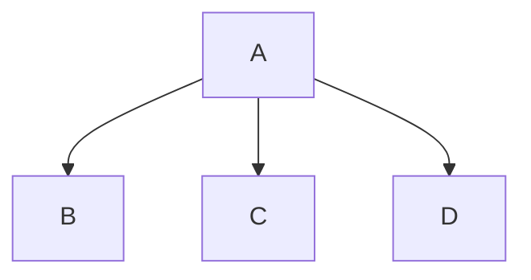

`mermaid.js` - специальный пакет языка JavaScript, который позволяет преобразовывать блоки кода в подобные графики:

````

````


**Mermaid** уже широко распространён в среде "красивого текста", обычно это файлы .md (Markdown). Файл, который ты читаешь, тоже является файлом текстовой разметки Markdown.  