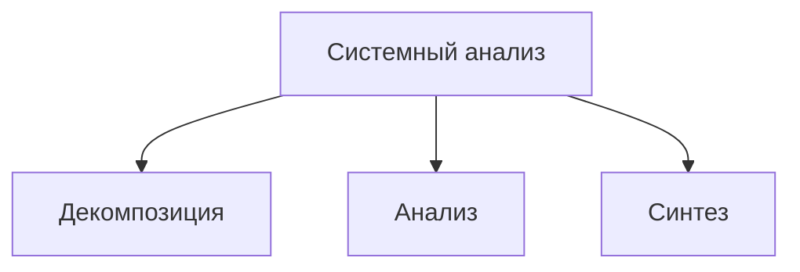

## Основные понятия

Общая теория систем - это научная и методологическая концепция, которая изучает объекты, рассматриваемые как системы, абстрагируясь от их конкретной природы (физической, биологической, социальной и т. д.) и фокусируясь на формальных взаимосвязях между их элементами. Её цель — выявить общие закономерности строения, поведения, функционирования и развития таких систем.

Дифференциация - это процесс разделения общей структуры на элементы, каждый из которых обладает уникальными характеристиками и выполняет отдельные, специфические функции. Этот процесс позволяет углублённо изучать отдельные компоненты системы, выделяя их особенности и роль в общей работе системы.

Интеграция - это процесс объединения различных систем, приложений и сервисов в единую экосистему, чтобы они могли слаженно работать, обмениваться данными и выполнять задачи как единая система. Цель — повысить эффективность бизнеса за счёт автоматизации процессов, устранения «информационных островов», минимизации ручного труда и обеспечения единого источника достоверных данных.

Системные исследования - это совокупность теоретических построений, концепций и методов, в которых объект исследования рассматривается как система. Ключевое понятие здесь — «система», которая может быть представлена как комплекс взаимосвязанных элементов, образующих некоторую целостность:

1. Исследование операций
2. Кибернетика
3. Системотехника
4. Системный анализ
5. Теория систем

Системный анализ - прикладное направление теории систем, применяемое при решении сложных слабоформализуемых проблем.

Цель системного анализа - поиск путей выхода из проблемной ситуации в рассматриваемой предметной области

# Основные методы системного анализа

![[Декомпозиция#^main]]
![[Анализ#^main]]
![[Синтез#^main]]

